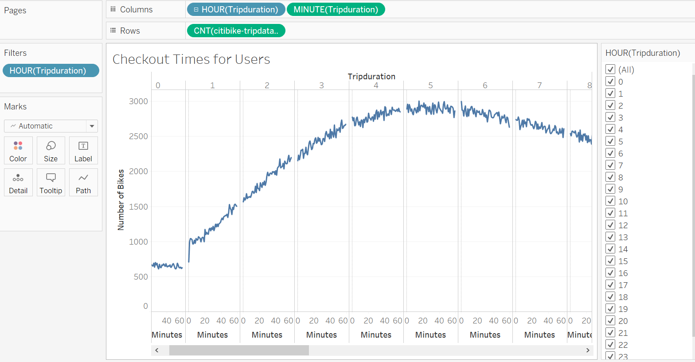
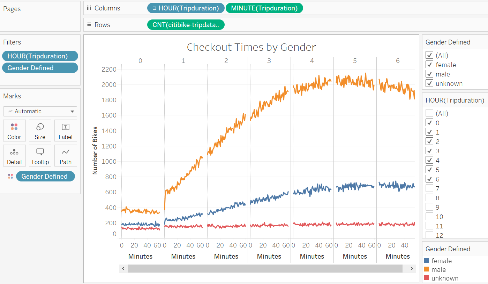
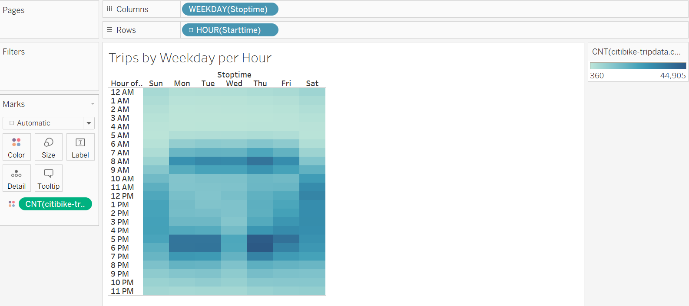
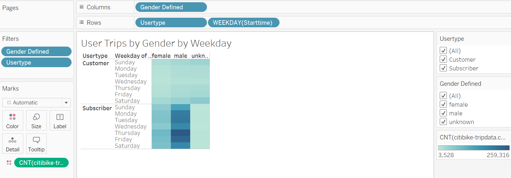
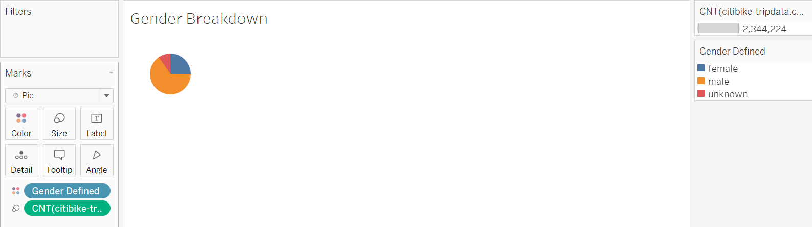
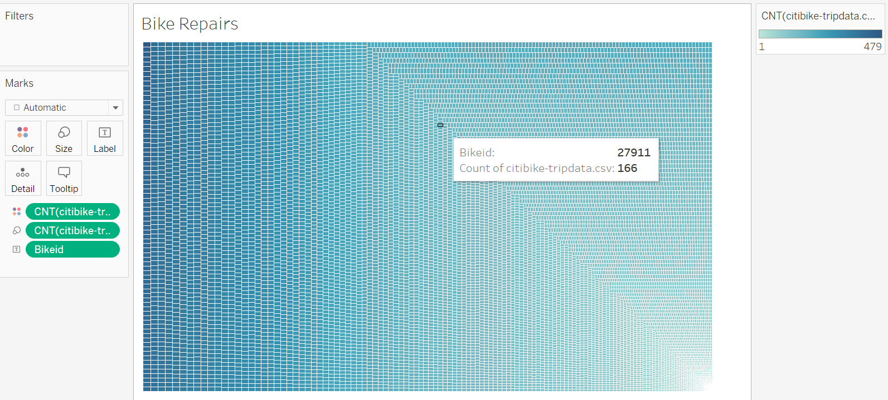
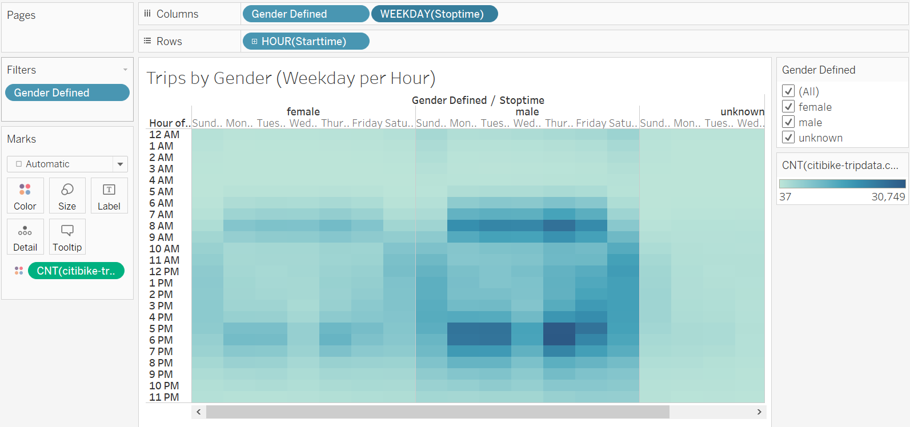

# bikesharing
# Overview of the analysis: 
The purpose of this analysis is to determine whether a bike sharing program within Des Monies would be a profitable business proposal. One of the stakeholders requested further analysis of bike trip data.  
# Results: 
Below each image is a description of the graph and the information that is reflected. 

One of the first visualizations I created was to see at what time the most amount of bikes are checked out. In this chart we see that between 4pm-6pm is the peak time that bikes are rented. 

By breaking out when bikes are checked out by gender we can see who is using the bikes at specific times. The chart reflects that more males rent bikes than females. The peak times for each gender are relativley the same. 

Using a heat map we can easily see what hour and day of week more bikes are rented than others. This graph shows the overall results as it is not broken out by gender. 

This graph reflects that more riders are on a subscription base instead of being a regular customer just paying for the individual trip.  Overall men prefer to pay for the subscription as they are frequent riders. 

The gender breakdown in a pie chart visually shows the proportion difference between each gender.  In relation to each gender shows the count of individuals within each group.

Each bike is correlated to a bikeid and each bike has a count of every time it was ridden.  In the top left represents the bikes that have been ridden the most, while the ones in the lower right corner have been ridden the least. Keeping track of the ride counts helps us know when each bike will need repairs. 

 
This graph has three different filters in order to reflect a detailed graph.  The filters we use are gender, weekday, and by hour, which narrows down the most popular rental times and specfically who is riding the bikes. 

# Summary: 
With our current analysis there are not enough individuals on the platform to make the business profitable.  There is only a small window of peak time and not enough bikes to satisfy demand.  An additional visualization that would be helpful to this proposal would be a graph using the filters birth year, hour, and gender.  Knowing the age groups that are currently utilizing the bikes would help know the age groups that marketing would target for additional riders. Another visualization would be the average of riders overall trips to see if setting a time limit on the bikes would negatively impact riders or if this would allow more potential riders an opportunity. 
